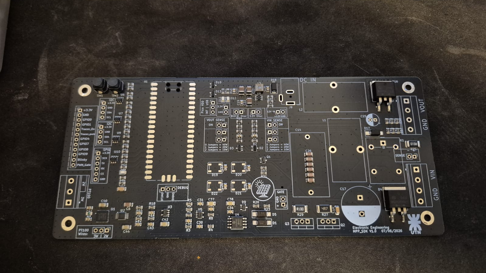
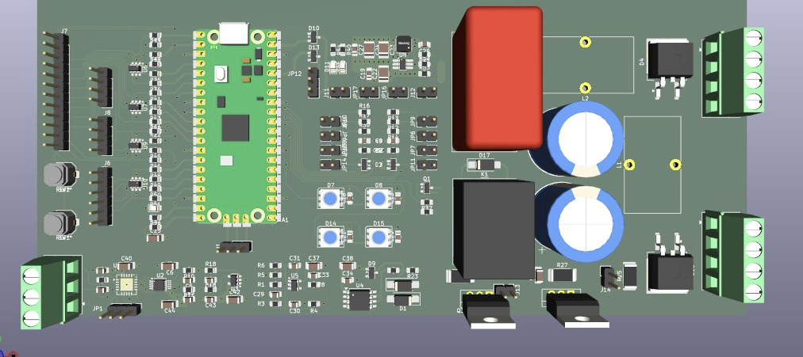

```{=latex}
\begin{IEEEkeywords}
MPPT, fotovoltaico, simulación, abstracción hardware, microcontrolador, SEPIC
\end{IEEEkeywords}
```

# Introducción

Los sistemas fotovoltaicos (FV) requieren algoritmos de seguimiento del punto
de máxima potencia (MPPT, del inglés *Maximum Power Point Tracking*) para
maximizar la energía extraída del panel bajo condiciones variables de irradiancia
y temperatura [@esram2007comparison]. Entre los métodos más difundidos se
encuentran Perturbar y Observar (P&O) e Incremento de Conductancia (INC), cuya
efectividad y costo computacional varían según la aplicación [@femia2005optimization].

El modelado preciso del panel FV es la base sobre la que se evalúan estos
algoritmos en simulación [@villalva2009comprehensive]. Herramientas como pvlib
permiten reproducir el comportamiento eléctrico de módulos reales con alta
fidelidad [@holmgren2018pvlib], aunque la transición desde la simulación hacia
la validación en hardware frecuentemente implica reescribir lógica de control
o adaptar interfaces, introduciendo fricciones y posibles discrepancias.

Adicionalmente, la comparación entre algoritmos en la literatura suele
realizarse en MATLAB/Simulink con código rara vez publicado y métricas
definidas por cada autor, lo que dificulta la reproducción y el contraste entre
trabajos. Este proyecto apunta a cubrir ese vacío con una biblioteca de control
abierta y un banco de comparación uniforme.

# Enfoque Propuesto

El framework separa el algoritmo de control del medio de ejecución mediante
una capa de abstracción de señales. El algoritmo solo observa una interfaz
mínima: lee un par tensión-corriente y escribe un ciclo de trabajo,
`read() -> (V, I)` y `write(D)`. Así, el mismo código corre indistintamente
sobre un modelo de panel simulado con pvlib o sobre un convertidor SEPIC real,
sin requerir modificaciones. El intercambio se reduce a seleccionar la fuente
de datos, simulada o hardware, al momento de inicializar el sistema.

Esta capa de abstracción es también la frontera natural del firmware: desde el
punto de vista de la Raspberry Pi, el microcontrolador RP2040 es simplemente
otra fuente de señales. Esto permite ajustar y comparar algoritmos en
simulación y luego ejecutarlos directamente en el banco de pruebas, con las
mismas métricas y bajo las mismas condiciones de entrada.

## Convertidor SEPIC

Se elige una topología SEPIC (Single-Ended Primary-Inductance Converter) porque
puede elevar o reducir la tensión del panel, de modo que el MPP puede ubicarse a
cualquier lado de la tensión de carga sin cambiar de topología. La resistencia
reflejada en la entrada,
$R_\text{eff}(D) = R_\text{load}\left(\tfrac{1-D}{D}\right)^2$, es monótona en el
ciclo de trabajo, lo que da un mapeo limpio y de un solo valor entre $D$ y el
punto de operación.

# Estado de Avance

A la fecha de este anteproyecto el proyecto cuenta con cuatro frentes en marcha:
el SDK de simulación, la placa de potencia, el banco de medición y la simulación
conmutada en PLECS.

## SDK de simulación y métricas

El SDK en Python implementa cinco algoritmos bajo la misma interfaz: P&O,
Incremento de Conductancia, Lógica Difusa (Fuzzy), Scan-and-Track y Optimización
por Enjambre de Partículas (PSO). Los dos últimos son métodos *globales*, capaces
de escapar de los máximos locales que genera el sombreado parcial; los tres
primeros son rastreadores *locales*. Cada algoritmo se mantiene portable a
microcontrolador: su paso de cálculo no tiene dependencias y conserva poco estado
escalar.

```{=latex}
\begin{figure*}[t]
\centering
\includegraphics[width=0.95\textwidth]{img/animate.png}
\caption{Herramienta interactiva de comparación en vivo. Bajo sombreado parcial
la curva P-V presenta dos picos; los controles de irradiancia (abajo) permiten
provocar el sombreado en tiempo real. Izquierda: punto de operación de cada
algoritmo sobre la curva, con el MPP global marcado (estrella). Derecha:
eficiencia de seguimiento en el tiempo. En este instante la mayoría alcanza el
MPP global mientras un método queda anclado al pico local ($\sim$88\%).}
\label{fig:live}
\end{figure*}
```

La Fig.\ \ref{fig:live} ilustra el fenómeno central que motiva los métodos
globales: bajo sombreado parcial la curva P-V tiene varios picos, y un rastreador
local se ancla al primero que encuentra, quedando por debajo del MPP global.

El banco de comparación mide a todos los algoritmos de la misma forma. La métrica
principal es la eficiencia energética en el tiempo,
$\eta = \sum_k P_k / \sum_k P_{\text{mpp},k}$, que pondera cuánta energía se
captura respecto de la disponible instante a instante. La Fig.\ \ref{fig:cyclic}
muestra una corrida bajo un perfil de sombreado cíclico: los rastreadores locales
quedan atrapados en máximos locales mientras que los globales recuperan el MPP
tras cada cambio.

```{=latex}
\begin{figure}[ht]
\centering
\includegraphics[width=\linewidth]{img/sim_cyclic.png}
\caption{Comparación de algoritmos en el SDK bajo un perfil de sombreado
cíclico. Los métodos globales (Scan-and-Track, PSO) recuperan el MPP tras cada
cambio de condiciones.}
\label{fig:cyclic}
\end{figure}
```

La Tabla\ \ref{tbl:cyclic} resume esa corrida (30 plateaus, 16 transiciones con
rampa, 36,7 s). Se observa el compromiso de fondo: los rastreadores locales son
rápidos (re-adquisición de pocos ms) pero quedan atrapados en máximos locales en
casi la mitad de los plateaus, entregando alrededor del 65 % del MPP cuando lo
están; los globales casi no se trampean y sostienen una eficiencia mayor, a costa
de una re-adquisición de cientos de ms por sus transitorios de búsqueda.

```{=latex}
\begin{table}[t]
\centering
\caption{Resultados del perfil cíclico (seed 1). $\eta$: eficiencia
energética; Acierto: plateaus terminados a menos de 5\% del MPP; Atrap.:
plateaus atrapados; P.atrap.: potencia media entregada estando atrapado;
reacq: re-adquisición media.}
\label{tbl:cyclic}
\begin{tabular}{lccccc}
\hline
Algoritmo & $\eta$ & Acierto & Atrap. & P.atrap. & reacq \\
\hline
P\&O       & 88,2\% & 16/30 & 14 & 65,4\% & 9 ms \\
InCond     & 88,3\% & 16/30 & 14 & 65,4\% & 8 ms \\
Fuzzy      & 88,5\% & 16/30 & 14 & 65,6\% & 7 ms \\
Scan\&Track & 95,0\% & 25/30 & 5  & 86,8\% & 464 ms \\
PSO        & 93,4\% & 21/30 & 9  & 88,0\% & 483 ms \\
\hline
\end{tabular}
\end{table}
```

Se modela además el ruido de medición como una capa que envuelve a la fuente de
señales y perturba solo lo que el controlador *ve*, dejando limpios al modelo y
al algoritmo. La Fig.\ \ref{fig:noise} muestra cómo degrada la eficiencia al
aumentar el ruido: los rastreadores locales de paso fijo colapsan cuando el ruido
por muestra supera el cambio de potencia de su perturbación, mientras que los
métodos globales sostienen un piso gracias a sus búsquedas periódicas. Este
resultado motiva un paso adaptativo y un disparo de re-búsqueda en el algoritmo
propio.

```{=latex}
\begin{figure}[ht]
\centering
\includegraphics[width=\linewidth]{img/sim_noise.png}
\caption{Robustez al ruido de medición. La eficiencia de los métodos locales de
paso fijo cae cuando el ruido supera el cambio de potencia por perturbación.}
\label{fig:noise}
\end{figure}
```

La Tabla\ \ref{tbl:noise} muestra la eficiencia energética $\eta$ a distintos
niveles de ruido, sobre un esquema cíclico reducido de 12 plateaus. Entre 0,25 y
0,50 % de fondo de escala los rastreadores locales de paso fijo caen de golpe,
mientras que los globales sostienen un piso cercano al 60 % gracias a sus
búsquedas periódicas.

```{=latex}
\begin{table}[t]
\centering
\caption{Eficiencia energética $\eta$ vs. nivel de ruido de medición
(desviación estándar como porcentaje del fondo de escala, 40 V / 1 A).}
\label{tbl:noise}
\begin{tabular}{cccccc}
\hline
$\sigma$ \%FE & P\&O & InCond & Fuzzy & S\&T & PSO \\
\hline
0,00 & 91,0\% & 91,0\% & 91,3\% & 94,6\% & 94,2\% \\
0,25 & 87,6\% & 87,6\% & 90,0\% & 92,1\% & 91,5\% \\
0,50 & 55,6\% & 55,5\% & 82,8\% & 80,8\% & 79,7\% \\
1,00 & 19,3\% & 19,5\% & 46,2\% & 64,1\% & 60,7\% \\
2,00 & 15,2\% & 15,4\% & 18,8\% & 62,1\% & 60,5\% \\
\hline
\end{tabular}
\end{table}
```

## Placa de potencia

La placa de potencia fue diseñada y enviada a fabricar; los componentes están
comprados. Integra la etapa SEPIC, el driver de gate, el sensado de tensión y
corriente con INA226 y el RP2040 como controlador. La Fig.\ \ref{fig:pcb}
muestra la placa fabricada y la Fig.\ \ref{fig:pcb3d} el modelo 3D del diseño.
Resta un armado y soldadura menor más las verificaciones de puesta en marcha,
estimados en unas dos semanas.

{width=100%}

{width=100%}

## Banco de trabajo preliminar

Se montó un banco de trabajo preliminar para probar el setup, principalmente los
paneles: dos Hissuma PSF10MONO en serie, con multímetros e instrumental para
relevar sus curvas I-V y contrastar el comportamiento real con el modelo
(Fig.\ \ref{fig:setup}). Es una forma temprana de validar el setup antes de
integrar la placa final. En paralelo se puso en marcha el firmware inicial sobre
RP2040 y Raspberry Pi 5, validando la comunicación SPI entre ambos
(Fig.\ \ref{fig:fw}).

```{=latex}
\begin{figure}[ht]
\centering
\includegraphics[width=0.85\linewidth]{img/setup_preliminar.png}
\caption{Banco de trabajo preliminar con los paneles Hissuma PSF10MONO en serie.}
\label{fig:setup}
\end{figure}

\begin{figure}[ht]
\centering
\includegraphics[width=0.82\linewidth]{img/firmware_setup.png}
\caption{Puesta en marcha del firmware: validación de la comunicación SPI entre
RP2040 y Raspberry Pi.}
\label{fig:fw}
\end{figure}
```

## Simulación conmutada en PLECS

El SDK valida el *algoritmo* con un modelo electrico cuasi-estático (sin rizado de
conmutación), mientras que PLECS valida el *hardware* simulando el convertidor
ciclo a ciclo. La Fig.\ \ref{fig:plecs} muestra dos versiones del modelo SEPIC de
20 W con P&O y Fuzzy y su respuesta ante un escalon de carga. Ambas herramientas
son complementarias y parte del trabajo en curso es definir cómo comparar sus
resultados de forma cuantitativa.

```{=latex}
\begin{figure}[ht]
\centering
\includegraphics[width=\linewidth]{img/plecs.png}
\caption{Simulación conmutada del SEPIC en PLECS: respuesta de P\&O y Fuzzy ante
un escalón de carga.}
\label{fig:plecs}
\end{figure}
```

# Algoritmo Propuesto

El aporte central de este trabajo es el framework de comparación y validación
sim-a-real, no un algoritmo nuevo: el espacio de métodos MPPT está ampliamente
explorado y un método más, por sí solo, aporta poco. El algoritmo propio se
plantea entonces como un caso de estudio que pone a prueba el framework. La línea
en evaluación parte de un rastreador global determinístico (Scan-and-Track) con un
disparo de re-búsqueda informado: un detector de escalón sobre $|\Delta P|/P$ para
cambios abruptos y una re-búsqueda periódica de respaldo para lo que el detector no
puede ver con solo $(V, I)$ en un punto de operación, como rampas lentas.

Esta etapa es de carácter exploratorio y permanece abierta. Lo más probable es que
no se implemente un método radicalmente nuevo, sino que se experimente sobre
variantes de bajo costo para hallar la que ofrezca el mejor compromiso entre
eficiencia de rastreo y costo de implementación en un microcontrolador de gama
baja. La pregunta a evaluar no es si se supera a los métodos existentes, sino si
un método suficientemente barato alcanza la eficiencia de los métodos globales más
pesados dentro de su presupuesto de memoria y cómputo. El resultado es informativo
en ambos sentidos: si lo logra, es un hallazgo práctico; si no, el framework
permite atribuir la diferencia con métricas reproducibles. La evaluación se realiza
primero en simulación y luego sobre el hardware real, midiendo tanto la eficiencia
energética como el costo de implementación, asumiendo que toda elección será un
compromiso entre ambos.

# Plan de Trabajo

Las próximas etapas son: completar el armado y verificación de la placa
(estimado fin de junio a mediados de julio), iniciar el desarrollo del firmware
de control, cerrar el barrido de parámetros del algoritmo propio en simulación,
definir el protocolo de comparación entre el SDK y PLECS, y ejecutar la
validación sim-a-real sobre el banco con la placa final.

# Referencias

::: {#refs}
:::
