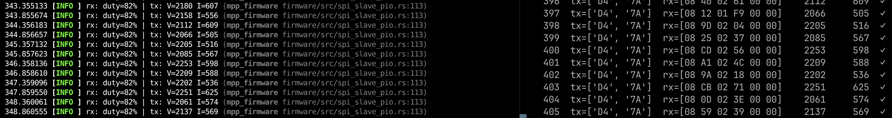

# mpp-firmware

Rust firmware for the Raspberry Pi Pico (RP2040) using [Embassy](https://embassy.dev/).

## Toolchain prerequisites

System packages (Debian/Ubuntu/Pop!_OS):

```sh
sudo apt install libudev-dev pkg-config
```

Rust tooling:

```sh
rustup target add thumbv6m-none-eabi
cargo install elf2uf2-rs probe-rs-tools
```

## Flashing — two options

### Option A: debug probe via a second Pico (recommended)

Gives you one-command flash + live defmt logs over RTT with no button holding.

#### 1. Flash debugprobe onto the probe Pico

Download `debugprobe_on_pico2.uf2` (for Pico 2 / RP2350) from:
<https://github.com/raspberrypi/debugprobe/releases/latest>

Hold **BOOTSEL** on the probe Pico while plugging it in,
then drag the UF2 onto the `RPI-RP2` disk.
It reboots as a CMSIS-DAP probe.

#### 2. Install udev rules (Linux, one-time)

```sh
curl -fsSL https://probe.rs/files/69-probe-rs.rules | sudo tee /etc/udev/rules.d/69-probe-rs.rules
sudo udevadm control --reload-rules
sudo udevadm trigger
sudo usermod -aG plugdev $USER
# log out and back in for the group change to take effect
```

#### 3. Wire probe to target

The target Pico exposes three SWD pads on the bottom edge (left → right when viewed
from the top with the USB connector facing up):

```text
[ SWCLK | GND | SWDIO ]
```

| Probe Pico 2W | Target RP2040 Pico  |
|---------------|---------------------|
| GPIO3 (SWDIO) | SWDIO (right pad)   |
| GPIO2 (SWDCLK)| SWCLK (left pad)    |
| GND           | GND   (middle pad)  |

Both boards can be powered from their own USB cables — no shared power wire needed.

##### RPi ↔ Pico SPI connection (HIL mode)

The Pico runs as **SPI1 slave**. Connect the Raspberry Pi (40-pin header, same on
RPi4/RPi400/RPi5) SPI0 master to the Pico SPI1 pins:

| RPi signal        | RPi pin | → | Pico signal       | Pico GPIO | Pico pin |
|-------------------|---------|---|-------------------|-----------|----------|
| MOSI (GPIO10)     | 19      | → | SPI1_RX (MOSI in) | GPIO12    | 16       |
| MISO (GPIO9)      | 21      | ← | SPI1_TX (MISO out)| GPIO11    | 15       |
| SCLK (GPIO11)     | 23      | → | SPI1_SCK          | GPIO10    | 14       |
| CE0  (GPIO8)      | 24      | → | SPI1_CS           | GPIO13    | 17       |
| GND               | 25      | — | GND               | —         | 18       |

Pico pins 14–18 are adjacent on the left side of the board (USB connector facing up).

**Frame protocol** (12 bytes, Mode 0, MSB-first, CS held low for entire frame):

| Direction      | Byte 0  | Byte 1  | Byte 2 | Byte 3 | Bytes 4-11    |
|----------------|---------|---------|--------|--------|---------------|
| MOSI (RPi→Pico)| DUTY_H  | DUTY_L  | 0x00   | 0x00   | 0x00 padding  |
| MISO (Pico→RPi)| V_H     | V_L     | I_H    | I_L    | 0x00 padding  |

DUTY is a u16 (0 = 0 %, 65535 = 100 %). V/I are u16, saturating: V in
millivolts, I in milliamperes (negative current clamps to 0). See "Sensing"
below. On the Pi side, construct `SpiMcuSource(v_scale=1e-3, i_scale=1e-3)`
to convert to volts/amps.

**Master clock speed**: bench-tested at **1 MHz** on the breadboard HIL
wiring - reliable. 8 MHz was tried and is unreliable (occasional torn/garbled
frames): the GPIO input synchronizer latency eats too much of the 125 ns bit
period, worse on jumper-wire signal integrity than a real PCB trace would
be. `scripts/spi_test.py` defaults to 1 MHz for this reason.

#### 4. Flash and stream logs

The `.cargo/config.toml` runner is already set to `probe-rs run --chip RP2040`:

```sh
cargo run --release
```

defmt log output appears directly in the terminal.

---

### Option B: BOOTSEL / mass-storage (no probe required)

Temporarily switch the runner in `.cargo/config.toml`:

```toml
runner = "elf2uf2-rs deploy"
```

Then:

1. Hold **BOOTSEL** on the target Pico while plugging it into USB.
it mounts as `RPI-RP2`.
2. Run:

```sh
cargo run --release
```

The UF2 is copied to the disk and the Pico reboots automatically.
No log output is available in this mode (RTT requires a probe connection).

## Build only

```sh
cargo build --release
```

## What it does

`src/main.rs` drives the SEPIC gate PWM from the `DUTY` value it receives
over the RPi SPI link, and feeds that link real `(V, I)` measurements read
from the on-board INA229 power monitor over SPI0 (see "Sensing" below).
Default `#[embassy_executor::main]` also emits defmt log lines over RTT.

## Sensing

The board carries a TI INA229 (`firmware/src/ina229.rs`) measuring the
panel-side bus voltage and shunt current over SPI0 (GPIO16/17/18/19, see the
GPIO table below; GPIO20 is the MAX31865's chip select, held idle high so it
never floats onto the shared bus).

- **Shunt resistor**: `R_SHUNT = 10 mOhm` (0.010 ohm). Not on the schematic
  (the `Device:R_US` symbol carries a generic placeholder value) - given
  directly by the project operator.
- **Wire units**: the firmware reports V in **millivolts** and I in
  **milliamperes** as saturating u16 over the existing 12-byte Pi frame
  (negative current clamps to 0). Calibration (register scaling, SHUNT_CAL)
  lives entirely in the firmware, next to the sensor; the Pi side just
  constructs `SpiMcuSource(v_scale=1e-3, i_scale=1e-3)`.
- **SPI mode**: the INA229 samples MOSI on the SCLK falling edge and shifts
  MISO out on the rising edge (datasheet Section 7.5.1) - CPOL = 0, CPHA = 1
  (SPI mode 1), clocked at 1 MHz. This is a different, independent SPI bus
  from the RPi-facing PIO link described above (which is a fixed-protocol
  bit-banged mode 0 frame, unrelated to this device's timing).

### Panel temperature (MAX31865, disabled)

`firmware/src/max31865.rs` has a working PT100 driver, but it's commented
out of `main.rs` for now - the bench probe is a PT1000, incompatible with
the board's fixed reference resistor. See the PR that disabled it for
details.

## Curve tracer

`Tracer_En` (GPIO2) switches relay K1, routing the panel input to a bleed
path for I-V curve sweeps instead of the normal SEPIC path. `Tracer_pwm`
(GPIO3) drives the bleed PWM. Both idle low at boot, which is also normal
MPPT operation (SEPIC path active, tracer released).

Bring-up aid: holding **But1** (GPIO0, active-low) energizes the relay
directly, so you can hear it click without any host tooling. Remove once
the curve tracer has real control logic.

## GPIO Assignments

| Pin | GPIO    | Net Name        | Function / Notes              |
|-----|---------|-----------------|-------------------------------|
| 1   | GPIO0   | But1            | Button 1 input                |
| 2   | GPIO1   | But2            | Button 2 input                |
| 4   | GPIO2   | Tracer_En       | Curve-tracer relay enable (idle low) |
| 5   | GPIO3   | Tracer_pwm      | Curve-tracer bleed PWM (idle low) |
| 6   | GPIO4   | GPIO4           | General purpose               |
| 7   | GPIO5   | I2C_SDA         | I2C data                      |
| 9   | GPIO6   | I2C_SCL         | I2C clock                     |
| 10  | GPIO7   | GPIO7           | General purpose               |
| 11  | GPIO8   | GPIO8           | General purpose               |
| 12  | GPIO9   | GPIO9           | General purpose               |
| 14  | GPIO10  | SPI1_SCK        | SPI1 clock                    |
| 15  | GPIO11  | SPI1_TX         | SPI1 MOSI                     |
| 16  | GPIO12  | SPI1_RX         | SPI1 MISO                     |
| 17  | GPIO13  | SPI1_CS         | SPI1 chip select              |
| 19  | GPIO14  | Blinky          | Status / heartbeat LED        |
| 20  | GPIO15  | PWM_Gate        | PWM output (via 10R + 3.3nF)  |
| 21  | GPIO16  | SPI0_MISO       | SPI0 MISO                     |
| 22  | GPIO17  | SPI0_CS1        | SPI0 CS 1 - INA229 (CS_INA)   |
| 24  | GPIO18  | SPI0_SCK        | SPI0 clock                    |
| 25  | GPIO19  | SPI0_MOSI       | SPI0 MOSI                     |
| 26  | GPIO20  | SPI0_CS2        | SPI0 CS 2 - MAX31865 (CS_TP100) |
| 27  | GPIO21  | INA_OOR_Alert   | INA out-of-range alert input  |
| 29  | GPIO22  | DRDY_TMP        | Temp sensor data-ready input  |
| 31  | GPIO26  | ADC_PWR         | ADC0 — power measurement      |
| 32  | GPIO27  | ADC_VOUT        | ADC1 — Vout measurement       |
| 34  | GPIO28  | ADC_Input_Curr  | ADC2 — input current          |

## Script Test


