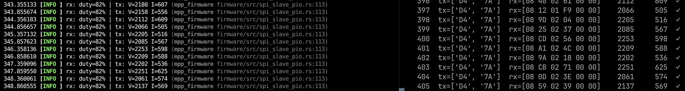

# mpp-firmware

Rust firmware for the Raspberry Pi Pico (RP2040) using [Embassy](https://embassy.dev/).

## Toolchain prerequisites

System packages (Debian/Ubuntu/Pop!_OS):

```sh
sudo apt install libudev-dev pkg-config
```

Rust tooling:

```sh
rustup target add thumbv6m-none-eabi
cargo install elf2uf2-rs probe-rs-tools
```

## Flashing — two options

### Option A: debug probe via a second Pico (recommended)

Gives you one-command flash + live defmt logs over RTT with no button holding.

#### 1. Flash debugprobe onto the probe Pico

Download `debugprobe_on_pico2.uf2` (for Pico 2 / RP2350) from:
<https://github.com/raspberrypi/debugprobe/releases/latest>

Hold **BOOTSEL** on the probe Pico while plugging it in,
then drag the UF2 onto the `RPI-RP2` disk.
It reboots as a CMSIS-DAP probe.

#### 2. Install udev rules (Linux, one-time)

```sh
curl -fsSL https://probe.rs/files/69-probe-rs.rules | sudo tee /etc/udev/rules.d/69-probe-rs.rules
sudo udevadm control --reload-rules
sudo udevadm trigger
sudo usermod -aG plugdev $USER
# log out and back in for the group change to take effect
```

#### 3. Wire probe to target

The target Pico exposes three SWD pads on the bottom edge (left → right when viewed
from the top with the USB connector facing up):

```text
[ SWCLK | GND | SWDIO ]
```

| Probe Pico 2W | Target RP2040 Pico  |
|---------------|---------------------|
| GPIO3 (SWDIO) | SWDIO (right pad)   |
| GPIO2 (SWDCLK)| SWCLK (left pad)    |
| GND           | GND   (middle pad)  |

Both boards can be powered from their own USB cables — no shared power wire needed.

##### RPi ↔ Pico SPI connection (HIL mode)

The Pico runs as **SPI1 slave**. Connect the Raspberry Pi (40-pin header, same on
RPi4/RPi400/RPi5) SPI0 master to the Pico SPI1 pins:

| RPi signal        | RPi pin | → | Pico signal       | Pico GPIO | Pico pin |
|-------------------|---------|---|-------------------|-----------|----------|
| MOSI (GPIO10)     | 19      | → | SPI1_RX (MOSI in) | GPIO12    | 16       |
| MISO (GPIO9)      | 21      | ← | SPI1_TX (MISO out)| GPIO11    | 15       |
| SCLK (GPIO11)     | 23      | → | SPI1_SCK          | GPIO10    | 14       |
| CE0  (GPIO8)      | 24      | → | SPI1_CS           | GPIO13    | 17       |
| GND               | 25      | — | GND               | —         | 18       |

Pico pins 14–18 are adjacent on the left side of the board (USB connector facing up).

**Frame protocol** (12 bytes, Mode 0, MSB-first, CS held low for entire frame):

MOSI (RPi→Pico): `[ DUTY_H | DUTY_L | CHECKSUM | CMD | 0x00 x 8 ]`

MISO (Pico→RPi): `[ V_H | V_L | I_H | I_L | VOUT_H | VOUT_L | TEMP_H | TEMP_L | CHECKSUM | ACK | 0x00 x 2 ]`

DUTY is a u16 (0 = 0 %, 65535 = 100 %). V/I/VOUT are u16, saturating: V/VOUT
in millivolts, I in milliamperes (negative current clamps to 0). TEMP is a
big-endian `i16` in centi-Celsius, or the sentinel `-32768` (`0x8000`) while
the MAX31865 probe stays disabled (see "Panel temperature" below). See
"Sensing" below for the sensor details. `CHECKSUM` (plan 014) is an XOR of
the preceding data bytes in each direction - `DUTY_H^DUTY_L^CMD` for MOSI,
`V_H^V_L^I_H^I_L^VOUT_H^VOUT_L^TEMP_H^TEMP_L` for MISO; `ACK` does NOT
participate in MISO's (it's an edge-triggered handshake signal, not a
telemetry reading - see below). `CMD` participates in MOSI's precisely so
a corrupted frame can't spoof a bulk-dump request by chance; it
is `0x00` on every normal frame, and XOR with `0x00` is a no-op, so this
didn't change the checksum's value for plain `write()`/`read()` traffic.
A checksum mismatch is treated as a corrupted-but-complete frame: the
firmware keeps the last commanded `DUTY` (does not zero it or count it as
a timeout) and ignores `CMD` for that frame; `SpiMcuSource`/`spi_test.py`
keep the last-good telemetry rather than propagate garbage, and report
`ack=0` rather than replay a possibly-stale cached value. On the Pi side,
construct `SpiMcuSource()` (defaults already match the firmware's
calibrated units and this checksum).

`CMD`/`ACK` are both `0x00` in normal operation - the curve-tracer
control/bulk-read commands (see "Curve tracer" below) are the only thing
that sets them: `0xB1` requests a bulk sweep-result dump, `0xB2` starts a
sweep, `0xB3` releases the tracer relay.

**Master clock speed**: 8 MHz is unreliable (occasional torn/garbled
frames) - the GPIO input synchronizer latency eats too much of the 125 ns
bit period, worse on jumper-wire signal integrity than a real PCB trace
would be. 1 MHz was bench-validated as reliable during plan 004's
bring-up, before the GPIO4 NeoPixel strip (plan 013) was wired in.

With the NeoPixels actively switching, 1 MHz started producing
corrupted-but-complete MISO frames (e.g. `I_raw` reading exactly `0x8000`,
a single bit, not random noise) - most likely electrical crosstalk from
the NeoPixels' fast switching onto nearby breadboard SPI1 wiring, not a
firmware bug (the firmware's `current_raw_to_ma()` math cannot itself
produce `0x8000` from any real INA229 reading, given `I_MAX_MA = 1000`).
**200 kHz is bench-confirmed clean with the NeoPixels active** -
`scripts/spi_test.py` defaults to 200 kHz for this reason. If the
NeoPixel wiring is ever rerouted away from the SPI1 wires (or moved onto
a real PCB), this may be revisitable back toward 1 MHz - not yet
retested.

#### 4. Flash and stream logs

The `.cargo/config.toml` runner is already set to `probe-rs run --chip RP2040`:

```sh
cargo run --release
```

defmt log output appears directly in the terminal.

---

### Option B: BOOTSEL / mass-storage (no probe required)

Temporarily switch the runner in `.cargo/config.toml`:

```toml
runner = "elf2uf2-rs deploy"
```

Then:

1. Hold **BOOTSEL** on the target Pico while plugging it into USB.
it mounts as `RPI-RP2`.
2. Run:

```sh
cargo run --release
```

The UF2 is copied to the disk and the Pico reboots automatically.
No log output is available in this mode (RTT requires a probe connection).

## Build only

```sh
cargo build --release
```

## Operating Modes

`FIRMWARE_MODE` selects between two compile-time modes in `main.rs`'s
top-level match. `MppTracker` is small enough to inline directly;
`PowerSupply`'s logic lives in its own module (`src/mode_power_supply.rs`).

### MppTracker (default)

Drives the SEPIC gate PWM on GPIO15 (`PWM_Gate`) at 100 kHz from the `DUTY`
value received over the RPi SPI link (u16, 0 = 0 %, 65535 = 100 %, updated
every 1 ms). Boots at 0 % duty, clamps at 95 % (`DUTY_MAX`) as a
defense-in-depth guard against a desynced master. If the SPI master goes
silent for ~500 ms (5 consecutive frame timeouts), the link is considered
lost and duty is forced to 0.

### PowerSupply (`src/mode_power_supply.rs`)

Ignores the Pi's commanded `DUTY` for gate control (the SPI frame still
exchanges normally, so `spi_test.py` keeps working for telemetry). A second
const, `PowerSupplyLoop`, selects:

- **`OpenLoop`**: a fixed `POWER_SUPPLY_FIXED_DUTY`, no feedback - sanity
  check for the SEPIC transfer-ratio math and ADC/PWM wiring, run before
  trusting `ClosedLoop`.
- **`ClosedLoop`**: regulates `Vout` to `POWER_SUPPLY_VOUT_MV` automatically
  (see "How the ClosedLoop controller works" below).

Gate duty is bounded by `DUTY_MAX` (95 %) in both sub-modes, same as
`MppTracker`.

**Watchdog behavior**: in `PowerSupply` mode, the SPI link-lost watchdog does
**not** force gate duty to zero - the local regulator keeps running
standalone with no SPI host attached, since that's the point of a bench
supply (explicit operator decision, see plan 011's history). The SPI slave
task itself keeps running unconditionally so telemetry stays available if a
Pi is connected, but its "frame timeout"/"link lost" WARN logs are
suppressed in `PowerSupply` mode - no Pi attached is expected there, not a
fault.

#### How the ClosedLoop controller works

Two stages (`ClosedLoopState`), at most once per fresh on-chip ADC sample
(~10 Hz, not every 1 ms tick):

1. **One-time feed-forward jump.** On the first plausible `MEAS_V_MV`
   (INA229, live `Vin`) reading, jump duty straight to the ideal SEPIC
   estimate instead of climbing there step by step (too slow on real
   hardware):

   ```text
   V_out = V_in * D / (1 - D)   =>   D = V_out / (V_in + V_out)
   ```

   Example: 5 V input, 5 V target -> `D = 0.5`, `ps_duty` jumps to 32768
   on the first sample.

2. **Continuous proportional trim**, every sample after: compare measured
   `Vout` (`MEAS_ADC_VOUT_MV`) against the target and nudge duty to close
   the gap.

   ```text
   err  = |target_mv - measured_mv|
   step = clamp(err / GAIN_DIVISOR, MIN_STEP, MAX_STEP)
   duty += step   if measured_mv < target_mv
   duty -= step   if measured_mv > target_mv
   ```

   This makes up the real losses the ideal formula ignores (the bench's
   0.5 duty measured 4.4 V open-loop, not the ideal 5.0 V - see
   `docs/rationale.md`'s CCM/DCM section) and keeps `Vout` locked to the
   setpoint through load/input changes afterward.

   `duty` is clamped to `DUTY_MAX` in both stages.

## What it does

`src/main.rs` drives the SEPIC gate PWM on GPIO15 (`PWM_Gate`) at 100 kHz.
Depending on `FIRMWARE_MODE`, it either applies the SPI-commanded `DUTY`
(`MppTracker`) or regulates output voltage to `POWER_SUPPLY_VOUT_MV`
(`PowerSupply`). It also feeds that link real `(V, I)` measurements read from
the on-board INA229 power monitor over SPI0 (see "Sensing" below). Default
`#[embassy_executor::main]` also emits defmt log lines over RTT.

## Sensing

The board carries a TI INA229 (`firmware/src/ina229.rs`) measuring the
panel-side bus voltage and shunt current over SPI0 (GPIO16/17/18/19, see the
GPIO table below; GPIO20 is the MAX31865's chip select, held idle high so it
never floats onto the shared bus).

- **Shunt resistor**: `R_SHUNT = 10 mOhm` (0.010 ohm). Not on the schematic
  (the `Device:R_US` symbol carries a generic placeholder value) - given
  directly by the project operator.
- **Wire units**: the firmware reports V in **millivolts** and I in
  **milliamperes** as saturating u16 over the existing 12-byte Pi frame
  (negative current clamps to 0). Calibration (register scaling, SHUNT_CAL)
  lives entirely in the firmware, next to the sensor; the Pi side just
  constructs `SpiMcuSource()` (its defaults already match).
- **SPI mode**: the INA229 samples MOSI on the SCLK falling edge and shifts
  MISO out on the rising edge (datasheet Section 7.5.1) - CPOL = 0, CPHA = 1
  (SPI mode 1), clocked at 1 MHz. This is a different, independent SPI bus
  from the RPi-facing PIO link described above (which is a fixed-protocol
  bit-banged mode 0 frame, unrelated to this device's timing).

### Panel temperature (MAX31865, disabled)

`firmware/src/max31865.rs` has a working PT100 driver, but it's commented
out of `main.rs` for now - the bench probe is a PT1000, incompatible with
the board's fixed reference resistor. See the PR that disabled it for
details.

### On-chip ADC

`ADC_PWR`/`ADC_VOUT`/`ADC_Input_Curr` (GPIO26-28) are read every 100 ms and
logged at ~1 Hz in millivolts.

- **`ADC_PWR`/`ADC_VOUT`**: calibrated. Both go through a 3x 75k + 10k
  (1% tolerance) divider, ADC reading across the 10k: `V_actual = V_adc *
  235k/10k = V_adc * 23.5` at the as-built divider (see the range table
  below for lower-range jumper options).
- **Divider range jumpers**: 1 or 2 of the three 75k resistors ahead of the
  10k leg can be bridged out to trade full-scale range for ADC resolution
  at lower operating voltages (a fixed ADC offset error is a much bigger
  fraction of the reading when few of the 4095 codes are in use). Ganged
  across both channels. Set `AdcDividerRange`/`ADC_DIVIDER_RANGE` in
  `main.rs` to match whichever jumpers are actually shorted - it is not
  auto-sensed, and the selected range is logged once at boot as a
  cross-check.

  | `AdcDividerRange` | Jumpers shorted | Divider | Full scale (`VREF=3.218 V`) |
  |-------------------|------------------|---------|------------------------------|
  | `Full` (default)  | 0 (all 3x 75k in series) | 235k/10k | ~75.6 V |
  | `Mid`              | 1 (2x 75k remain)        | 160k/10k | ~51.5 V |
  | `Low`              | 2 (1x 75k remains)       | 85k/10k  | ~27.3 V |

  Confirmed on-target: at ~4 V bench input, `Full` read `ADC_PWR` ~9% high
  versus the INA229; `Low` reads ~0.03% off. Use `Low` for bench/low-voltage
  testing, `Full`/`Mid` nearer the design's ~40 V ceiling where more ADC
  codes are naturally in use even with the larger divider.
- **`ADC_Input_Curr`**: still raw pin mV. It's the INA281 analog
  cross-check for the INA229's `MEAS_I_MA` (logged on the same line for
  comparison), but the INA281's gain/shunt aren't resolved yet.
- **ADC reference voltage**: `ADC_VREF_MV = 3218` in `raw_to_mv()` is a
  measured constant, not the nominal 3.3 V - multimeter reading at the
  Pico's `ADC_VREF` pin (physical pin 35). This closed about a quarter of
  the original ~9% `ADC_PWR` vs INA229 discrepancy; the remaining ~4.5% is
  within the divider's 1% resistor tolerance plus RP2040 ADC gain error
  (no factory calibration exists to correct the latter, see plan 010's
  progress note). Re-measure and update this constant if the divider
  resistors or reference circuit ever change.

## Curve tracer

`Tracer_En` (GPIO2) switches relay K1, routing the panel input to a bleed
path for I-V curve sweeps instead of the normal SEPIC path. Both it and
`Tracer_pwm` idle low/0 at boot, which is also normal MPPT operation
(SEPIC path active, tracer released).

**The bleed path is a linear current sink, not a switched load.**
`Tracer_pwm` (GPIO3, hardware PWM at 10 kHz - `PWM_SLICE1` channel B) is
low-pass filtered by two RC stages (R1/C29, R3/C30 - 10K + 100nF each) into
an analog setpoint; op-amp U5 (OPA171) then servos Q3's gate until the
voltage across the 100 mOhm sense resistor R29 matches it. Q3 runs in its
linear region as a voltage-controlled current source, so **`Tracer_pwm`'s
duty commands a load current**, not a switching ratio. The 10 kHz is just
the DAC carrier - the RC stages (tau = 1 ms each) filter its ripple, and a
setpoint step settles in ~10 ms.

Two consequences worth knowing before touching the sweep:

- Full scale is amps (the ESP32-C3 reference device's equivalent load is
  ~3.9 A) while a small lit panel sources a couple hundred mA, so almost
  the entire duty range commands more current than the panel can deliver
  and simply pins it at short-circuit. This is what auto-ranging exists to
  solve (see "Sweep" below).
- Q3 dissipates that current linearly at the panel's full voltage, so the
  sweep is hard-capped at `TRACER_SWEEP_DUTY_MAX_PERCENT` (10 %) of full
  scale on top of the `TRACER_P_MAX_MW` cutoff - the reference device caps
  its own load identically.

**Trigger**: either a single debounced press of **But1** (GPIO0,
active-low), or the Pi sending `CMD = 0xB2` on a normal SPI frame
(`SpiMcuSource.start_sweep()`) - both start exactly one sweep. A sweep
already running ignores further triggers from either source, and a
still-held button only re-arms once released. Runs as its own task
(`mode_curve_tracer.rs`), independent of `FirmwareMode` - a
`TRACER_ACTIVE` flag forces the SEPIC gate duty to 0 for the sweep's whole
duration, regardless of whether `MppTracker` or `PowerSupply` is active.

**Auto-range**: each sweep first finds its own top, so the 20 recorded
points span the real curve rather than piling up past the knee. It reads
Voc at zero load, then doubles the commanded current until the panel
voltage collapses below `TRACER_COLLAPSE_PERCENT_OF_VOC` (15 %) of Voc -
bracketing Isc from below - then bisects `TRACER_SCAN_BISECT_STEPS` (4)
times to tighten it, and sweeps up to that knee plus
`TRACER_SWEEP_HEADROOM_PERCENT` (115 %). Probes use a shorter settle
(`TRACER_SCAN_SETTLE_MS`, 60 ms) since they only decide "collapsed yet?".
Doubling rather than a linear scan because Isc can land anywhere from a
fraction of a percent to most of full scale depending on panel and light.
If Voc is under `TRACER_MIN_VOC_MV` (500 mV) there is no panel worth
sweeping (dark, disconnected, or the relay didn't transfer) and the sweep
aborts; if the panel never collapses even at the duty cap, the sweep runs
to the cap and the curve stops short of Isc. This replaces the reference
device's manual "set current range" dial.

**Sweep**: `Tracer_pwm` steps linearly from 0 to that auto-ranged top in 20
points (`TRACER_SWEEP_POINTS`), 250 ms settle per step (`TRACER_SETTLE_MS`),
averaging 5 consecutive fresh INA229 readings per point
(`TRACER_AVG_SAMPLES`, gated on a sample-freshness counter - not a fixed
delay, same pattern as `power_supply` mode's `ClosedLoopState`). A safety
cutoff (`TRACER_I_MAX_MA`, referencing the INA229's own calibrated
full-scale; `TRACER_P_MAX_MW`) aborts the sweep - zeroes the PWM and
returns to idle, but leaves the relay engaged (see "Relay lifetime"
below) - if breached, rather than only logging.
The cutoff is checked continuously during the settle window
(`TRACER_SETTLE_POLL_MS`), not only after it, so a spike right after a
duty step is caught quickly; a stalled INA229 read also aborts the sweep
(`TRACER_SAMPLE_TIMEOUT_MS`) rather than hanging it and the SEPIC gate
force-zeroed forever. All constants live in `mode_curve_tracer.rs` and are
starting points that need on-target re-tuning; there is no
schematic-derived time constant for the bleed path to derive them from
analytically.

**Relay lifetime**: `Tracer_En` stays engaged across any number of
sweeps, no longer released automatically when a sweep ends, breach or
not. **But1** only starts a sweep; releasing the relay is a separate,
explicit action - send `CMD = 0xB3` (`SpiMcuSource.release_relay()`) from
the Pi. This lets several sweeps run back-to-back without the relay
re-clicking between them.

**Results**: dumped via `defmt`/RTT as `(V_mV, I_mA)` lines when the sweep
completes or aborts, and separately fetchable from the Pi via
`SpiMcuSource.request_sweep()` (`mpp_sdk/io/spi_mcu.py`). The most recent
sweep's result is held in `mode_curve_tracer.rs` until fetched once
(`take_last_sweep()`); a three-step handshake rides on top of the steady
telemetry frame without changing its shape:

1. Pi requests a dump via a spare MOSI byte (`CMD`, `0xB1`) on an ordinary
   frame - duty control is unaffected.
2. Pico acks on the *next* ordinary frame via a spare MISO byte (`ACK`):
   `0x80 | point_count` if a result is ready, `0x00` otherwise.
3. Once armed, the Pi issues one distinct, larger SPI transaction (83
   bytes for the default 20-point sweep: `MAGIC | N_POINTS | (V,I) x N |
   CHECKSUM`) to fetch it - separate from, not a growth of, the 12-byte
   telemetry frame.

A frame timeout at any point in the handshake (Pi didn't follow through,
or a torn frame) resets straight back to normal telemetry rather than
leaving `spi_pio_task` expecting a frame shape that never arrives - see
`BulkState`'s doc comment in `spi_slave_pio.rs`.

## Status indicators

Two independent LEDs answer two different questions:

- **GPIO14 (`Blinky`)**: is the firmware alive at all? Toggles ~1 Hz in
  the main loop regardless of SPI activity - a frozen LED means a hung
  firmware, not just "no traffic right now."
- **GPIO4 (4x WS2812 NeoPixels, `PIO1` + its own DMA channel, decoupled
  from the SPI-slave task)**: is the Pi actually talking to me? Flashes
  dim green briefly on every successfully-received SPI frame, dark
  otherwise - a frozen or dark strip with the heartbeat LED still
  blinking means the link has gone quiet (or `spi_pio_task` itself is
  stuck), not that the whole board is down. Driven by `PACKET_COUNT`, an
  `AtomicU32` bumped once per received frame in `spi_slave_pio.rs` -
  nothing SPI-timing-sensitive runs on the NeoPixel's own task.

## GPIO Assignments

| Pin | GPIO    | Net Name        | Function / Notes              |
|-----|---------|-----------------|-------------------------------|
| 1   | GPIO0   | But1            | Button 1 input                |
| 2   | GPIO1   | But2            | Button 2 input                |
| 4   | GPIO2   | Tracer_En       | Curve-tracer relay enable (idle low) |
| 5   | GPIO3   | Tracer_pwm      | Curve-tracer bleed PWM, hardware PWM (idle 0 %) |
| 6   | GPIO4   | NeoPixel_Din    | 4x WS2812 NeoPixels, packet-receive heartbeat |
| 7   | GPIO5   | I2C_SDA         | I2C data                      |
| 9   | GPIO6   | I2C_SCL         | I2C clock                     |
| 10  | GPIO7   | GPIO7           | General purpose               |
| 11  | GPIO8   | GPIO8           | General purpose               |
| 12  | GPIO9   | GPIO9           | General purpose               |
| 14  | GPIO10  | SPI1_SCK        | SPI1 clock                    |
| 15  | GPIO11  | SPI1_TX         | SPI1 MOSI                     |
| 16  | GPIO12  | SPI1_RX         | SPI1 MISO                     |
| 17  | GPIO13  | SPI1_CS         | SPI1 chip select              |
| 19  | GPIO14  | Blinky          | External heartbeat LED, ~1 Hz |
| 20  | GPIO15  | PWM_Gate        | SEPIC gate PWM, 100 kHz (via 10R + 3.3nF) |
| 21  | GPIO16  | SPI0_MISO       | SPI0 MISO                     |
| 22  | GPIO17  | SPI0_CS1        | SPI0 CS 1 - INA229 (CS_INA)   |
| 24  | GPIO18  | SPI0_SCK        | SPI0 clock                    |
| 25  | GPIO19  | SPI0_MOSI       | SPI0 MOSI                     |
| 26  | GPIO20  | SPI0_CS2        | SPI0 CS 2 - MAX31865 (CS_TP100) |
| 27  | GPIO21  | INA_OOR_Alert   | INA out-of-range alert input  |
| 29  | GPIO22  | DRDY_TMP        | Temp sensor data-ready input  |
| 31  | GPIO26  | ADC_PWR         | ADC0 — power measurement      |
| 32  | GPIO27  | ADC_VOUT        | ADC1 — Vout measurement       |
| 34  | GPIO28  | ADC_Input_Curr  | ADC2 — input current          |

## Script Test


